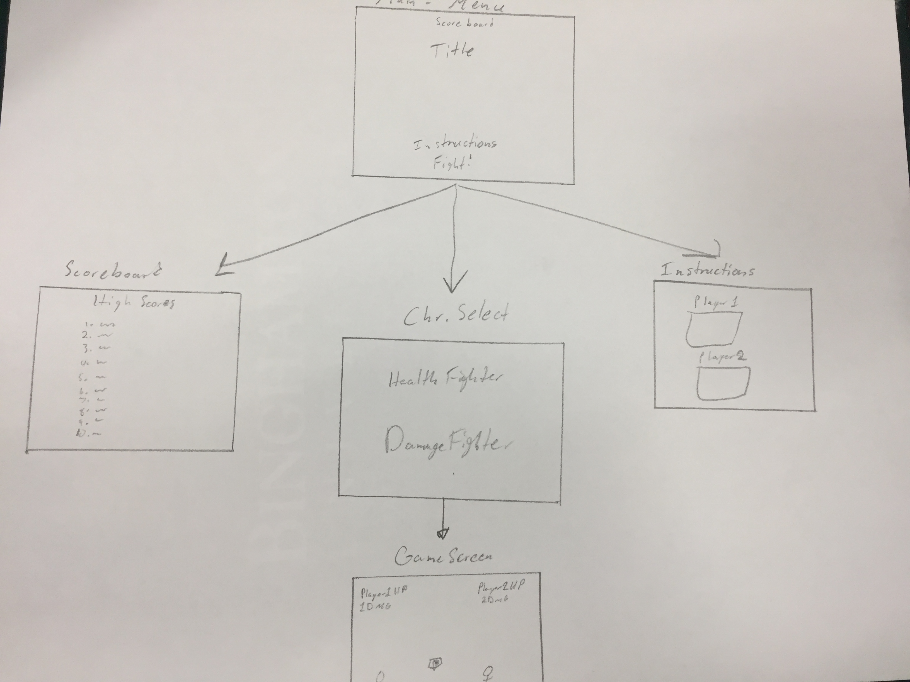
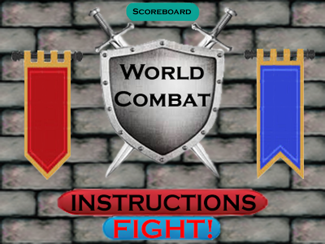
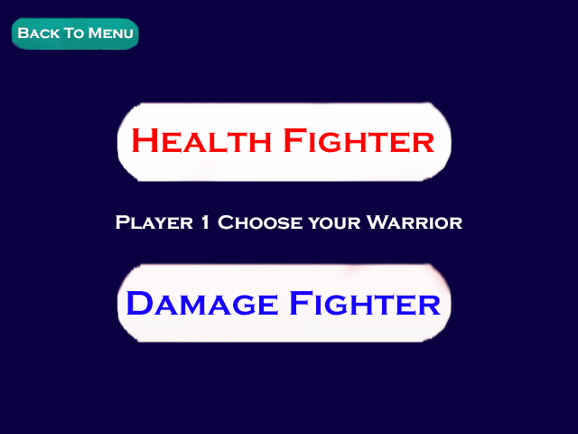

# World Combat
## CS 110 Final Project
### Fall 2018

https://github.com/binghamtonuniversity-cs110/final-project-fall18-seal-team-six

https://docs.google.com/presentation/d/1FLJ5FqtJcUqq2rhltYa_9BkCrMSrcOTkTFZZYjY7py4/edit#slide=id.p

### Seal Team Six:
#### Zane Benjamin-Herchanik, Cole Cipp, Ethan Breban

***

## I. Description of Project
The fighting game genre has been one of the most popular in the industry since the times of the original Street Fighter. With 'World Combat', our group decided to put a spin on the traditional 2D two-player fighting game by implementing a projectile-based combat system rather than relying mostly on hand-to-hand combat like many fighting games tend to do. An element of variety and strategy is implemented into the game through randomly appearing power-ups and the player's choice of one of two characters: one which has high damage output, and one which has high health.

***    

## II. User Interface Design

### GUI Concept

#### Main Menu
The first thing that the user sees when the game is run. The user can view the scoreboard and instructions screens by clicking their respective buttons ("Scoreboard" and "Instructions) and go to the character selection screen by clicking "Fight!"

#### Scoreboard
This screen shows the user the top 10 scores for the game, based on the amount of time that was spent in the game screen. The user can click the "Main Menu" button to return to the main menu.

#### Instructions
This screen tells the user the controls for playing the game for both player 1 and player 2. The user can click the "Main Menu" button to return to the main menu.

#### Character Select Screen
This screen allows the user to select one of two characters by clicking either "Health Fighter" or "Damage Fighter". The user can also click the "Main Menu" button to return to the main menu.

#### Game Screen
This is the screen where the actual game takes place. The game begins as soon as the user enters this menu. Player 1 and 2 can move around and fight with one another using their arrows as well as boost their stats by picking up power-ups. The game ends when one of the player's character's health is fully depleted. A message is then displayed that says "Game Over" and tells the user if they achieved a top 10 score.

### Final GUI

***        

## III. Program Design

### Non-Standard Libraries and Modules Used
* Pygame (https://www.pygame.org/) - A module set incorporating many common game development functions into python, developed by Pete Shinners and Pygame Community. Includes crucial graphical elements as well as a musical playback functionality

### Class and File Relationships

### List of Classes
* __Hero__ - A  parent class that defines the main fighter of the game - the class defines movement features such as moving left, moving right, and jumping. The class also defines values for the damage and health of the fighter. The class also contains a fight method which returns true or false depending on whether or not the hero has no more health. The class also contains accessor and mutator methods for all values defined in the class

* __HighHealthFighter__ - A class that inherits from the Hero class and sets the health value of the fighter to a higher value than the default health value established in the hero class.

* __HighDamageFighter__ -A class that inherits from the Hero class and sets the damage value of the fighter to a higher value than the default damage value established in the hero class.

* __HighHealthPowerUp__ - A minor class that increases the health value of any hero object when they collide. Has a method called applyHealthUprgade which applys the health upgrade as well as an accessor and mutator method for its position.

* __HighDamagePowerUp__ - A minor class that increases the health value of any hero object when they collide.Has a method called applyDamageUprgade which applys the health upgrade as well as an accessor and mutator method for its position.

* __Arrow__ - a minor class which serves as the tool that inflicts damage to the fighters. Has accessor and  mutator methods in order to get and move the position of the arrow.

* __Controller__ - A class that defines the “rules” and logic of the interlocking relationships between the other classes and UI, as well as establishes the data permanence of the high score, and opens the actual game window itself. The collision functions, key bindings, and refresh rate are established here, and it calls each of the prior classes and their UI elements to “load” them when ran.

***

## IV. Tasks and Responsibilities

### Software Lead - Zane Benjamin-Herchanik

Worked as integration specialist by helping organize the code for the main game into the proper MVC format, which allowed all portions of the code to be run from a single file. Ensured that the team was fully adhering to all specifications in the project description. He worked with the front end in writing the code for the Controller(). Also learned to use the markdown language to write the proposal.

### Front End Specialist - Cole Cipp

Front-end lead conducted significant research on using pygame to create visual aspects such as buttons and on-screen text. He used this information to design and program a consistent UI to help the player navigate the title screen, the instructions page, and the character selection screen. Used Photoshop to create the images for the menus and worked with the back end to integrate the UI into the back end code.

### Back End Specialist - Ethan Breban

The back end specialist helped with the “Model” portion of 'World Combat' by writing the major classes that would be used in the main game, as well as implementing major pygame functionality into each of them. He collaborated with the Front End Specialist in the implementation of the classes into our Controller file, especially the collisions, as well as developing the high-score database. Also implemented other additional features into the game such as making sure that the two characters are always facing one another.

***

## V. Testing

### Menu Testing
First, we run Controller() by running the file 'main.py' in the terminal and ensure that it opens the main menu. Then, we click on the 'Instructions' button to ensure that the Instructions menu is opened which should display the controls for the game. Next, we press the 'Exit' button from the Instructions menu to ensure that it returns the user to the main menu. 

We then press the 'Fight!' button and make sure that the character selection screen opens properly. Next, we select one of the characters for player 1 and ensure that the other character is selected for player 2. From here, we make sure that the game screen is opened after the characters are selected.

### Game Testing

Once we have properly opened up the game screen, we begin by checking to see if the characters for players 1 and 2 are the correct characters that were selected previously. Next, we test the movement of each of the characters. 

For player 1's character, we test the 'A' and 'D' keys to ensure that they move the character left and right respectively and work correctly both in single presses and when the keys are held down. We also press the 'W' key to ensure that player 1's jumping works properly and their character jumps and and falls back down to the ground.

For player 2's character, we test the left and right arrow keys to ensure that they move the character left and right respectively and work correctly both in single presses and when the keys are held down. We also press the up arrow key to ensure that player 2's jumping works properly and their character jumps and and falls back down to the ground.

Next, we begin to playtest and move both characters around to ensure everthing is functioning properly. Then, we test the power-ups to make sure that they appear properly, do what they are supposed to (improve health or damage) and disappear from the screen once used. We then begin to fire arrows with both characters and ensure that they are functional and deal damage to the characters when they are hit.

Lastly, we try to reach the game over state by attacking and killing one of the characters. Once one of the characters is dead, the game over screen should be displayed and should correctly tell the user which player won the game. Finally we test the game over menu's buttons for main menu and quit to ensure that they are functioning properly.

### Acceptance Test Procedure

| Step                  | Procedure     | Expected Results  | Actual Results |
| ----------------------|:-------------:| -----------------:| -------------- |
|  1  | Run Controller() | 1) The main menu opens and is functioning  |          |
|  2  |Click "Instructions" button| 1) The instructions page opens and clear instructions are displayed for playing the game| |
|  3  |Click “Exit” button|1) Returns to the main menu, menu is normal and functional    |                 |
|  4  |Click “Fight!” button | 1) The character selection screen opens and displays the two possible character choices |       |
|  5  | Character Selection | 1) Player 1 is prompted to select one of two characters   2) Once player 1 has selected their character, player 2 is assigned the character that player 1 did not choose.  |                 |
|  6  | Press ‘A’ key, hold ‘A’ key | 1) Player 1’s character moves to the left   2) Player 1’s character continues to move to the left while left arrow is held |                 |
|  7  | Press ‘D’ key, hold ‘D’ key | 1) Player 1’s character moves to the right   2) Player 1’s character continues to move to the right while right arrow is held  |           |
|  8  | Press ‘W’ key |  1) Player 1’s character jumps and falls to the ground as expected  |                 |
|  9  | Press LEFT ARROW, hold LEFT ARROW | 1) Player 2’s character moves to the left   2) Player 2’s character continues to move to the left while left arrow is held |        |
|  10 | Press RIGHT ARROW, hold RIGHT ARROW | 1) Player 2’s character moves to the right   2) Player 2’s character continues to move to the right while right arrow is held |     |
|  11 | Press UP ARROW | 1) Player 2’s character jumps and falls to the ground as expected |                 |
|  12 | Playtesting | 1) Health and damage are functional for both characters   2) Power-ups work correctly |         |
|  13 | Attempt to reach game over state | 1) One player damages the other until they have no health left   2) The game over menu appears and displays which player won   3) The ‘Main Menu’ and ‘Quit’ buttons are functional |    |
